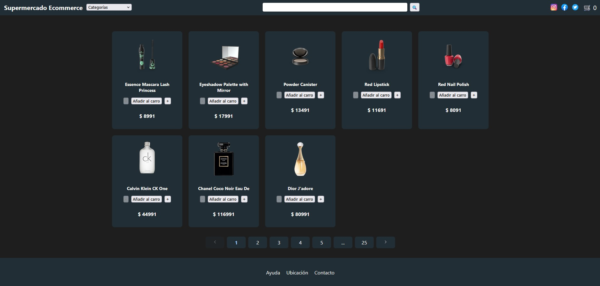
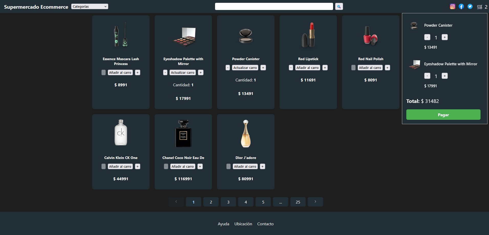
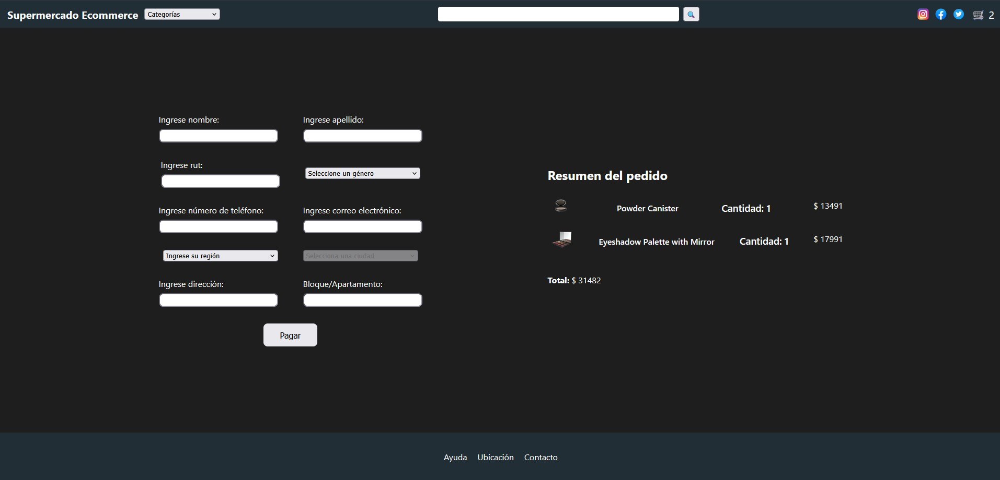

# 🛒 Supermercado E-Commerce 

Este es un proyecto de práctica desarrollado en React y Typescript que permite la visualización de productos, administración de un carro de compras y completar la compra mediante un proceso de checkout.

---

## 📸 Vista previa

### Página principal




### Carro de compra




### Checkout




---

## 🎯 Objetivos del proyecto 

Este proyecto fue construido desde cero para abordar los siguientes retos técnicos:
1.  **Gestión de Estado Global:** Controlar el flujo de datos del carrito de compras (agregar, modificar cantidades, eliminar y calcular totales) de manera eficiente sin caer en prop drilling.
2.  **Tipado Estricto:** Utilizar TypeScript para garantizar la integridad de los datos de los productos y el estado del carrito, reduciendo errores en tiempo de desarrollo.
3.  **Experiencia de Usuario (UX/UI):** Crear una interfaz responsiva, intuitiva y con validaciones en tiempo real para simular un entorno de producción real.

---

## 🚀 Características y funcionalidades

*   **Catálogo dinámico & filtros:** Visualizar productos con búsqueda en tiempo real y filtrado por categorías.
*   **Gestión del carrito en tiempo real:** Control de la cantidad de un producto, ya sea de manera creciente y decreciente, validando que no se pueda llegar a una cantidad negativa.
*   **Checkout con formulario validado:** Sección que incluye un resumen final del carrito y un formulario de envío con validación de campos obligatorios y formatos.
*   **Diseño Responsivo:** Adaptado para que tenga una navegación fluida tanto en móvil como en un computador de escritorio.

---

## 🛠️ Stack tecnológico & decisiones técnicas

*   **React 19 & Vite:** Elegido por su velocidad en el entorno de desarrollo y la optimización del bundle final.
*   **TypeScript:** Implementado para definir interfaces claras asegurando un código escalable y tipado.
*   **Gestión de Estado (Zustand) :**  Utilizado para centralizar toda la lógica del carrito y permitir que los distintos componentes en donde vuelva a utilizar, por ejemplo, el header o el checkout, puedan mostrar los cambios de manera instantánea.
*   **Validación de Formularios (Reach Hook Form y Zod):** Utilizado el primero para crear toda lo que contiene el formulario de envío y zod para poder validar cada uno de los campos
*   **Estilos (CSS):** Los estilos fueron desarrollados utilizando CSS puro, separando los archivos por componente para facilitar su mantenimiento.

---

## 🧠 Aprendizajes clave y retos superados

*   **El reto de las cantidades en el carrito:** Al principio, mientras trataba de actualizar la cantidad del producto en la página no lo hacía en el carrito y viceversa. Lo solucioné al centralizar toda la parte del carrito en Zustand, permitiendo que cualquier componente compartiera el mismo estado de forma consistente.

* **Aprendiendo a validar datos con Zod:** Inicialmente pensaba realizar todas las validaciones directamente en el formulario utilizando React. Sin embargo, a medida que aumentaban las reglas de validación, el código comenzó a hacerse difícil de mantener. Decidí utilizar Zod para centralizar las validaciones y mantener el formulario mucho más limpio y organizado.


---
## 📌 Mejoras a futuro

* **[ ] Persistencia del carrito de compras**
* **[ ] Autenticación de usuarios**
* **[ ] Tener productos favoritos siendo usuario**
* **[ ] Mostrar una página individual por producto**
* **[ ] Sistema de comentarios por productos**
* **[ ] Finalizar compra mediante un método**
* **[ ] Generar una boleta o comprobante de pago**

---
## 📦 Instalación y Ejecución Local

```bash
git clone https://github.com/cristobalceppi25/supermercado-ecommerce.git
```

Entra al proyecto:

```bash
cd react-supermarket
```

Instala las dependencias:

```bash
pnpm install
```

Inicia el servidor de desarrollo:

```bash
pnpm dev
```

Abre tu navegador en:

```
http://localhost:5173
```